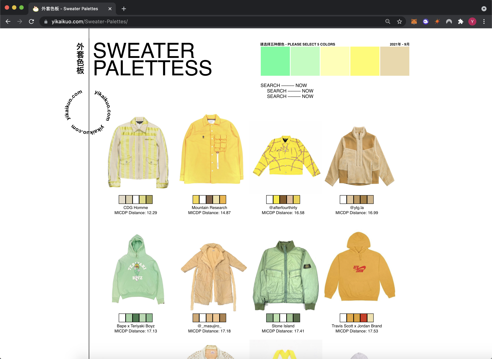

# Sweater Palettes

[https://yikaikuo.com/Sweater-Palettes](https://yikaikuo.com/Sweater-Palettes)
<br>
A visual index of two thousand outerwear pieces, searchable by color palette. 
<br>
<br>
<strong>Approximate repo size is 500 MB</strong>
<br>
<br>

<p align="center">
    
</p>


## Project setup
```
npm install
```

### Compiles and hot-reloads for development
```
npm run serve
```

### Compiles and minifies for production
```
npm run build
```

### Lints and fixes files
```
npm run lint
```

### Customize configuration
See [Configuration Reference](https://cli.vuejs.org/config/).
